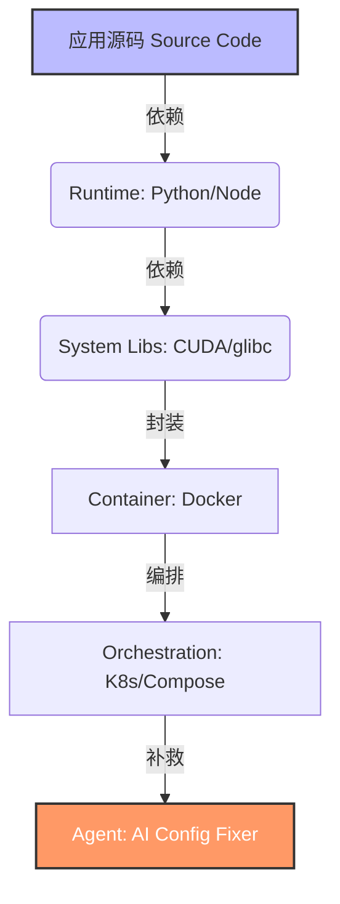
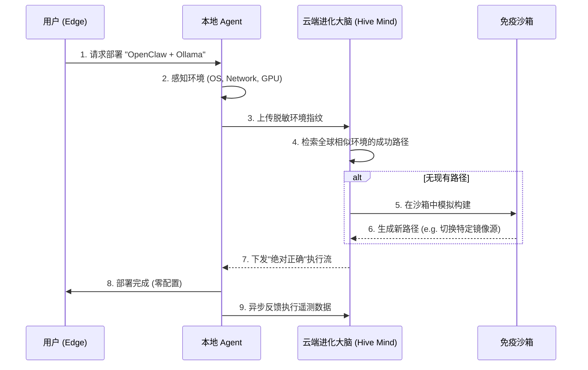

> **摘要**: 当我们拥有了能通过图灵测试的 AI，为什么部署它还需要 1990 年代的手工劳动？本文探讨了当前 AI 软件栈的“配置地狱”与“基础设施割裂”问题，并基于第一性原理，提出了一种基于群体智能的自进化运维网络架构——**Project Entropy-Zero**。

---

## 0x01 引言：一场 48 小时的“技术降级”

在刚刚过去的 48 小时里，为了部署一套 2026 年最前沿的 Agent 架构（如 OpenClaw 结合 Ollama），我经历了一场典型的“技术降级”。

作为一个计算机科学教育者，我发现我们正处于一个极其魔幻的断层中：
* **顶层**：我们有参数量千亿、具备复杂推理能力的 LLM。
* **底层**：我们的工程地基却在腐烂。为了让 AI 跑起来，我们需要手动配置 Docker 网络桥接、修补 Python 依赖冲突、在复杂的全球网络环境中寻找可用的镜像源，甚至手动处理 `Connection Refused`。

我们正在用**手摇纺纱机**的逻辑，去驱动**核聚变引擎**。

## 0x02 诊断：软件工程的“熵增陷阱”

目前的开源软件生态陷入了严重的**“抽象泄漏” (Abstraction Leakage)**。为了解决依赖问题，我们引入了层层封装，但每一层封装都在引入新的复杂度。

### 2.1 “套娃式”架构的崩溃

目前的 AI 部署路径通常是这样的：

* **第一层熵增**：Runtime 环境极其脆弱（版本地狱）。
* **第二层熵增**：Docker 引入了文件系统隔离和网络隔离，导致简单的 Localhost 通信变成了复杂的端口映射与 DNS 问题。
* **第三层熵增**：为了解决配置难，我们引入 AI Agent 辅助配置。但这本质上是用**概率模型（LLM）**去解决**确定性工程问题**，风险极高。

### 2.2 隐形房间里的大象：基础设施的地缘割裂

除了软件架构的内源性问题，我们还面临着**全球基础设施的物理割裂 (Infrastructure Heterogeneity)**。

在实际的科研与开发中，物理位置决定了技术成本。
* **供应链断裂**：依赖包的分发不再是透明的。Docker Hub、PyPI、HuggingFace 的连接稳定性因地域而异。
* **协议层路障**：反向代理、自签证书、DNS 污染……这些人为制造的“数字血栓”，让本地 AI 难以连接全球知识网络。

**结论**：当前的 AI 软件栈假设了一个“真空球形”的完美网络环境，而现实环境是布满荆棘的泥沼。

---

## 0x03 第一性原理：最好的配置就是“零配置”

埃隆·马斯克在工程设计中推崇第一性原理：“最好的零件就是没有零件”。同理，**最好的配置就是没有配置 (Zero-Config)**。

下一代 AI 基础设施（AI-Native Infrastructure）必须回归生物学的生存逻辑：

1.  **环境无关 (Environment Agnostic)**
    软件不应依赖宿主 OS 的库。它应以 **Unikernel** 或 **全静态编译 (Static Binary)** 的形式交付。落地即运行，不依赖 `apt`，不依赖 `pip`。

2.  **感知连接 (Sensory Networking)**
    摒弃 `IP:Port` 这种反人类的抽象。在局域网内，智能体应当通过 **mDNS / Gossip 协议** 自动发现彼此并建立加密握手，就像生物通过气味识别同类。

3.  **确定性自愈 (Deterministic Self-healing)**
    当环境不兼容时（如 CUDA 版本不匹配），系统不应抛出堆栈跟踪（Stack Trace），而应触发内置的**JIT 环境重构**。

---

## 0x04 愿景：Project Entropy-Zero (零熵计划)

基于上述思考，我提议启动科研项目：**Project Entropy-Zero**。

这不是另一个 DevOps 工具，而是一个**“基于群体智能的自进化运维网络”**。它的核心目标是：利用全球开发者的试错数据，构建一个能够对抗软件熵增的超级 Agent。

### 4.1 核心架构蓝图

### 4.2 关键技术创新

1.  **分布式感知 (The Tentacles)**
    当一位北京的开发者解决了某个特殊的镜像源问题，Agent 会将**[脱敏环境特征 + 修复策略]**上传。这个“经验”瞬间被共享给所有处于相似网络环境的用户。
    * *Result:* **One fixes, all benefit.**

2.  **因果推断 (Causal Inference)**
    利用 LLM 分析报错日志，精准区分“网络问题”、“代码逻辑问题”与“环境冲突”。不再盲目重试，而是精准归因。

3.  **动态适应 (Dynamic Adaptation)**
    Agent 不再死板执行 Dockerfile。它会根据当前的网络拓扑（如是否存在透明代理），实时重写构建脚本，自动注入适配当前地理位置的 `GOPROXY` 或 `PIP_INDEX_URL`。

---

## 0x05 呼吁：拒绝做“配置专家”

作为教育者，我不希望我的学生将宝贵的青春浪费在编写 `docker-compose.yaml` 或寻找可用的 PyPI 镜像上。那是对人类智慧的浪费。

**我们需要的不是更多的配置工具，而是消灭配置本身。**

Project Entropy-Zero 旨在探索一种可能性：**让软件像生命体一样，拥有适应环境、自我修复的本能。**

如果你对以下方向感兴趣：
* **LLM 驱动的自动化运维 (AIOps)**
* **跨环境系统自愈 (Self-Healing Systems)**
* **群体智能知识库 (Swarm Intelligence)**

欢迎联系加入我的实验室或 Fork 相关研究。让我们停止制造垃圾，开始真正的工程。

---
